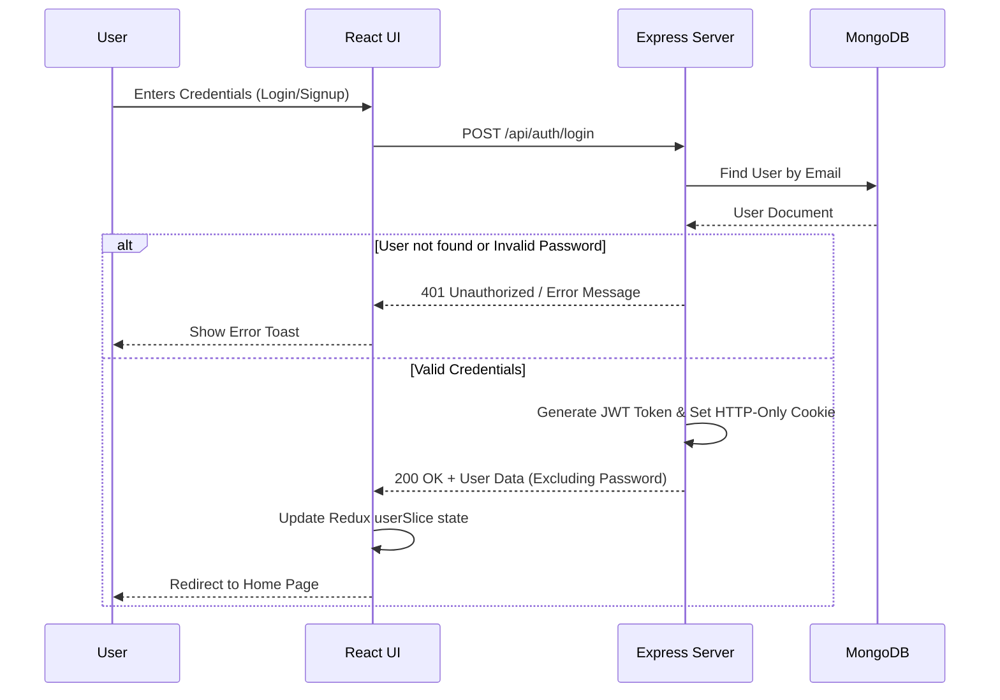
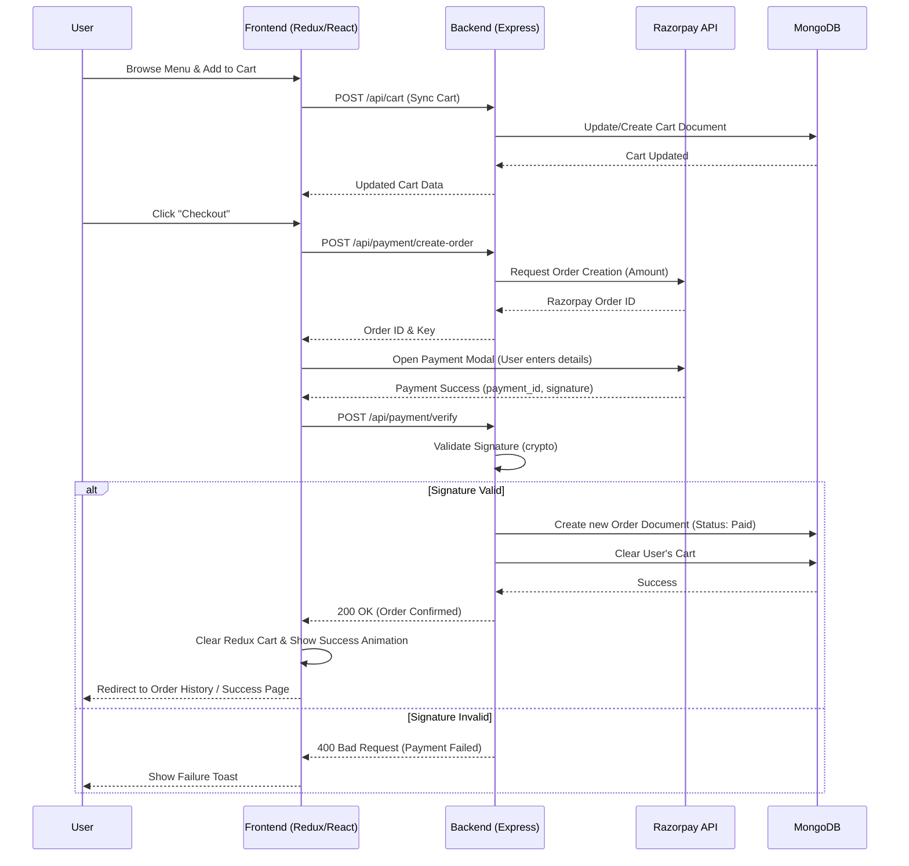
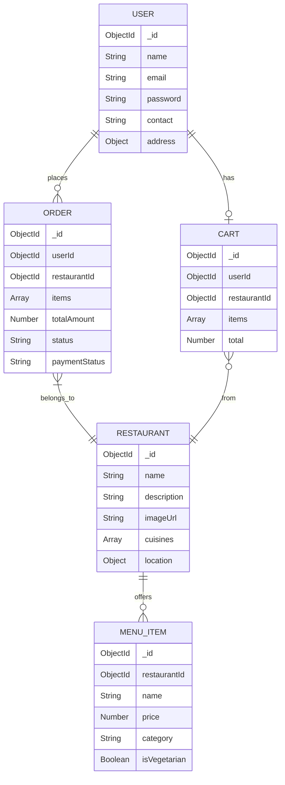

# Eats - Architectural Flowcharts

This document provides a visual representation of the architecture and data flow within the Eats application. It uses [Mermaid.js](https://mermaid.js.org/) to render the flowcharts.

## 1. High-Level System Architecture

This diagram illustrates the macro-level interactions between the React frontend, the Node/Express backend, the MongoDB database, and third-party external services.

```mermaid
graph TD
    %% Define Styles
    classDef frontend fill:#61DAFB,stroke:#333,stroke-width:2px,color:#000;
    classDef backend fill:#68A063,stroke:#333,stroke-width:2px,color:#fff;
    classDef database fill:#47A248,stroke:#333,stroke-width:2px,color:#fff;
    classDef external fill:#F05032,stroke:#333,stroke-width:2px,color:#fff;

    %% Client / Frontend
    subgraph Client [Frontend: React 19 + Vite]
        UI[User Interface Components]:::frontend
        State[Redux Toolkit Store<br>(userSlice, cartSlice, restaurantSlice)]:::frontend
        API_Client[Axios Instance / API Utils]:::frontend
        
        UI <--> State
        UI --> API_Client
    end

    %% Server / Backend
    subgraph Server [Backend: Node.js + Express]
        Router[Express Routers<br>(auth, restaurant, cart, order, payment)]:::backend
        AuthMid[Auth Middleware<br>(JWT verification)]:::backend
        Controllers[Controllers Logic]:::backend
        Models[Mongoose Models<br>(User, Restaurant, MenuItem, Cart, Order)]:::backend
        
        API_Client -->|REST API Calls (JSON)| Router
        Router --> AuthMid
        AuthMid --> Controllers
        Router --> Controllers
        Controllers <--> Models
    end

    %% Database
    subgraph Database Layer
        DB[(MongoDB)]:::database
        Models <-->|Read / Write (Mongoose)| DB
    end

    %% External Services
    subgraph External APIs
        Cloudinary[Cloudinary<br>(Image Hosting)]:::external
        Razorpay[Razorpay<br>(Payment Gateway)]:::external
        
        Controllers -.->|Image Upload / Retrieval| Cloudinary
        Controllers -.->|Payment Creation / Verification| Razorpay
    end
```

---

## 2. User Authentication Flow

This diagram outlines the process of a user signing up or logging in, demonstrating how JWTs (JSON Web Tokens) are generated and managed.



---

## 3. Order and Checkout Flow

This flowchart tracks the user's journey from adding items to the cart, confirming an order, processing payment via Razorpay, and saving the final order to the database.



---

## 4. Entity-Relationship Diagram (ERD)

A simplified view of how the primary MongoDB collections relate to each other.


