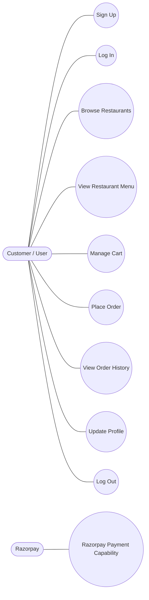
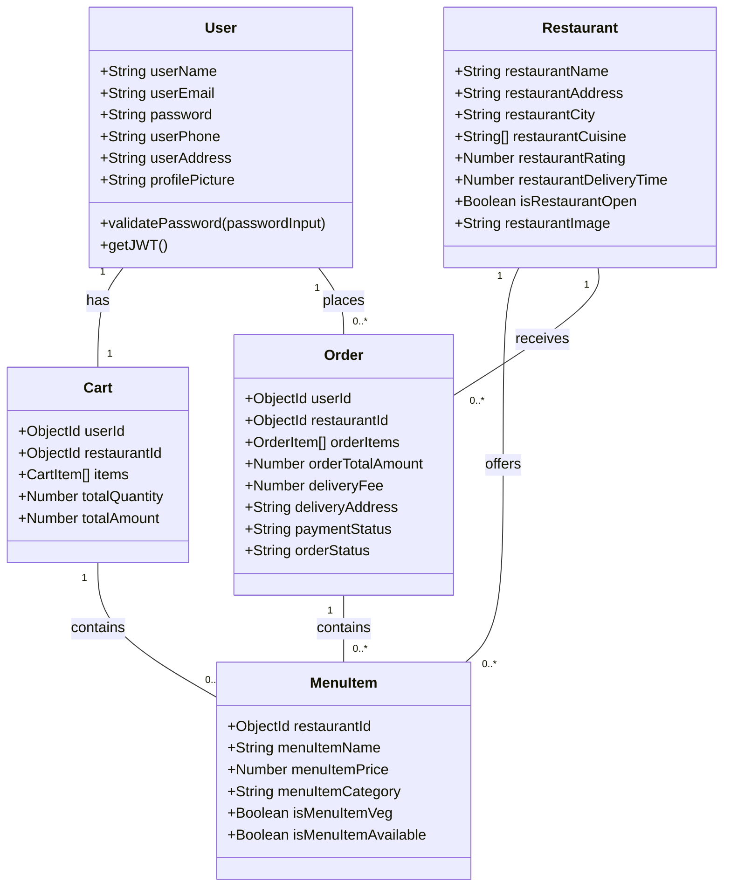
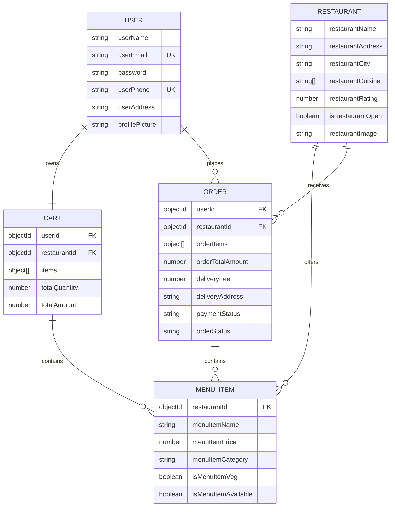

# Eats System Diagrams

This document summarizes the Eats platform with three views of the system:
- Use Case Diagram: User-facing behavior and interactions.
- Class Diagram: Core backend domain structure and logic.
- ER Diagram: The persisted data model and relationships.

---

## 1. Use Case Diagram

This diagram shows the major interactions between the Customer and the Eats platform, with Razorpay shown only as backend-supported payment capability.

---

## 2. Class Diagram

This diagram represents the core entities in the system, their attributes, and their behaviors.

---

## 3. Entity Relationship (ER) Diagram

This diagram illustrates the database schema and how different entities relate to each other in MongoDB.

