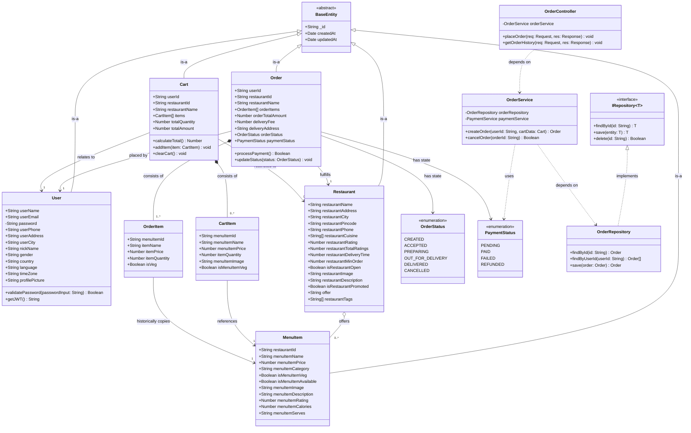

# System Design & Object-Oriented Architecture: Eats App

This document outlines the detailed **Object-Oriented Programming (OOP) Class Diagram** and analysis for the **Eats Application**, modeling the current schema capabilities with a scalable design suitable for transitioning to **TypeScript** under best-practice System Design guidelines.

## 1. Structural Analysis of the System

The project is structured into **two main components** :

* **Client (Frontend)**: A React/Vite-based application divided into domain-specific, modular folders (`AuthPage`, `Cart`, `HomePage`, `Orders`, `Profile`, `Restaurants`).
* **Server (Backend)**: An Express/Node.js REST API using Mongoose for MongoDB. It follows an **MVC-like pattern** (`controllers`, `models`, `routes`, `middlewares`, `services`).

### Comprehensive Model Fields Analysis:

Before designing the diagram, we carefully evaluated the database schema structure from the Mongoose models:

1. **User Model**: Core authentication and profile model.
   * *Fields*: `userName`, `userEmail`, `password` (hashed), `userPhone`, `userAddress`, `userCity`, `nickName`, `gender`, `country`, `language`, `timeZone`, `profilePicture`.
   * *Methods*: `validatePassword()`, `getJWT()`.
2. **Restaurant Model**: Represents the restaurant vendor.
   * *Fields*: `restaurantName`, `restaurantAddress`, `restaurantCity`, `restaurantPincode`, `restaurantPhone`, `restaurantCuisine` (Array), `restaurantRating`, `restaurantTotalRatings`, `restaurantDeliveryTime`, `restaurantMinOrder`, `isRestaurantOpen`, `restaurantImage`, `restaurantDescription`, `isRestaurantPromoted`, `offer`, `restaurantTags`.
3. **MenuItem Model**: Represents individual items offered by a restaurant.
   * *Fields*: `restaurantId` (Ref), `menuItemName`, `menuItemPrice`, `menuItemCategory`, `isMenuItemVeg`, `isMenuItemAvailable`, `menuItemImage`, `menuItemDescription`, `menuItemRating`, `menuItemCalories`, `menuItemServes`.
4. **Cart & CartItem Models**: Handles user intent to order.
   * *Cart*: `userId` (Ref), `restaurantId` (Ref), `restaurantName`, `totalQuantity`, `totalAmount`.
   * *CartItem* (Subdocument): `menuItemId` (Ref), `menuItemName`, `menuItemPrice`, `itemQuantity`, `menuItemImage`, `isMenuItemVeg`.
5. **Order & OrderItem Models**: The final transactional boundary.
   * *Order*: `userId` (Ref), `restaurantId` (Ref), `restaurantName`, `orderTotalAmount`, `deliveryFee`, `deliveryAddress`, `paymentStatus` (Enum), `orderStatus` (Enum).
   * *OrderItem* (Subdocument): `menuItemId` (Ref), `itemName`, `itemPrice`, `itemQuantity`, `isVeg`.

---

## 2. Comprehensive OOP Class Diagram

Below is the **Mermaid Class Diagram** designed specifically to help your project lead understand the application’s deep **architectural topology**. It emphasizes strong typing, single responsibility, and rigorous relationship flows modeled for a TypeScript conversion.

## 3. Explaining the Class Diagram Relationships (For the Project Lead)

We explicitly applied several crucial **System Design principles** to make this diagram professional:

1. **Inheritance (`<|--`)**:
   * Models like `User`, `Restaurant`, `Order`, `Cart`, and `MenuItem` all inherit from `BaseEntity`. This is standard **OOP behavior** ensuring all our models uniformly get a unique ID (`_id`, UUID) and timestamps (`createdAt`, `updatedAt`).
2. **Composition (`*--`)**:
   * `Order` composed of `OrderItem`. Subdocuments physically do not exist outside the lifecycle of their parent document. If you delete an `Order`, the `OrderItems` perish.
   * `Cart` composed of `CartItem`.
3. **Aggregation (`o--`)**:
   * `Restaurant` aggregates `MenuItem`. While items belong to a restaurant, mathematically an item is its own autonomous record (own collection in MongoDB) that can be accessed and indexed separately.
4. **Realization/Implementation (`<|..`)**:
   * Added interfaces like `IRepository<T>` establishing a robust **Data Access pattern**. `OrderRepository` realizes this blueprint. This makes the database layer interchangeable (helpful for testing and TypeScript mocking).
5. **Dependency (`..>`)**:
   * Mapped standard **Controller-Service-Repository** architecture dependencies. The `OrderController` relies completely on the `OrderService` which contains business logic. Your controllers remain clean and merely handle HTTP streams.
6. **Navigable Association (`-->`)**:
   * Indicates one-way querying power. An **Order** inherently knows about the **User** and **Restaurant** that participated in the transaction.

## 4. Path to TypeScript Migration Strategy

When you transition to TypeScript, leverage the patterns detailed in this diagram:

* Define `export interface IBaseEntity` or an `abstract class` for your mongoose defaults.
* Enforce tight return types on Controllers using custom Express `Request/Response` interfaces.
* Extract the `.pre('save')` hooks and `Bcrypt` logic into specific `AuthService` utilities so Models are isolated exclusively for Schema mapping.

> *This diagram renders seamlessly directly on GitHub. Ensure Mermaid diagrams are supported in your Markdown preview configurations.*
