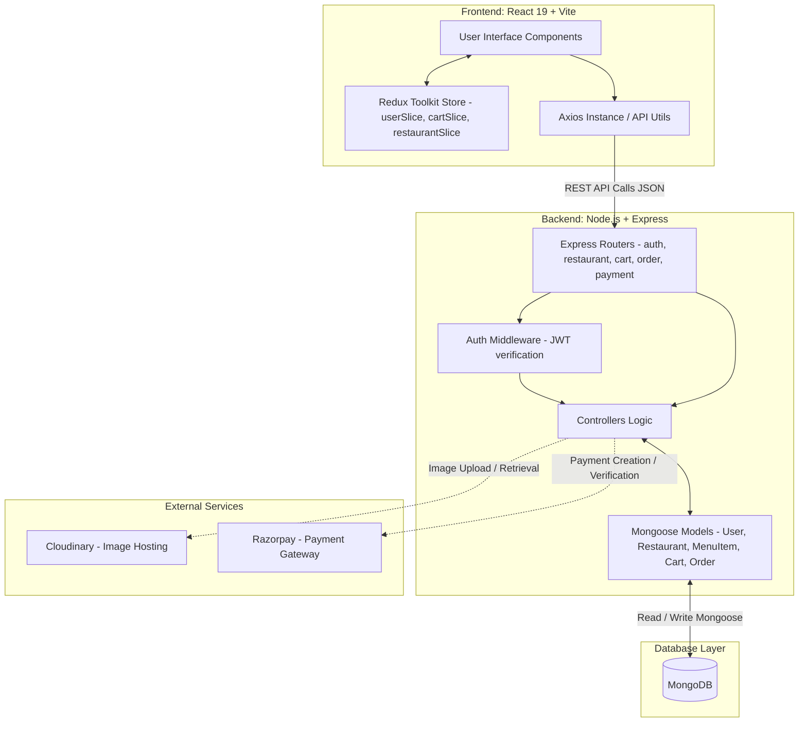
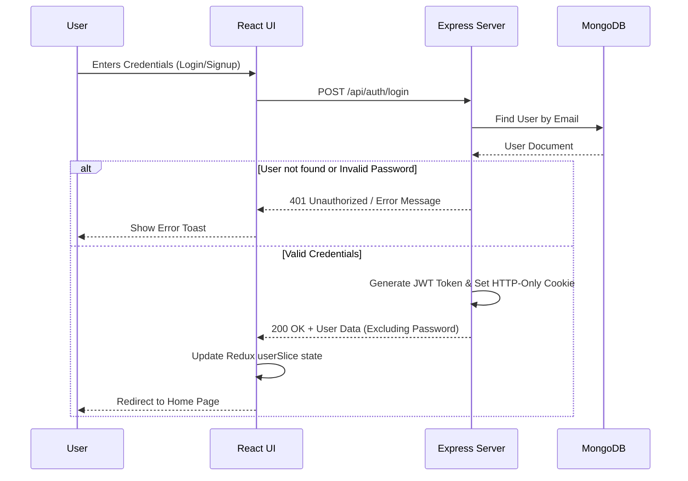
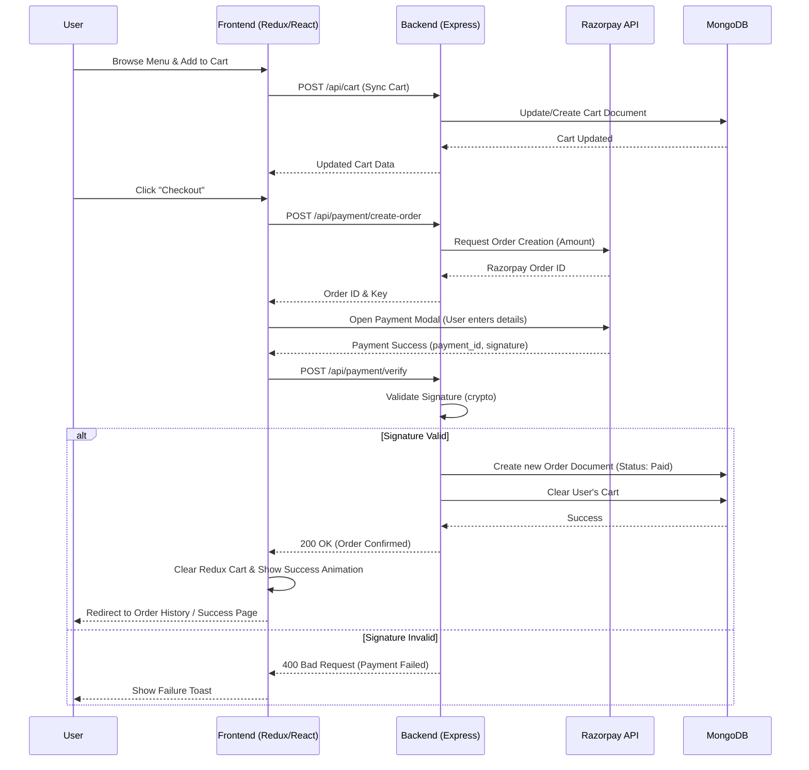

## 1. High-Level System Architecture

This diagram illustrates the macro-level interactions between the React frontend, the Node/Express backend, the MongoDB database, and third-party external services.

---

## 2. User Authentication Flow

This diagram outlines the process of a user signing up or logging in, demonstrating how JWTs (JSON Web Tokens) are generated and managed.

---

## 3. Order and Checkout Flow

This flowchart tracks the user's journey from adding items to the cart, confirming an order, processing payment via Razorpay, and saving the final order to the database.

---