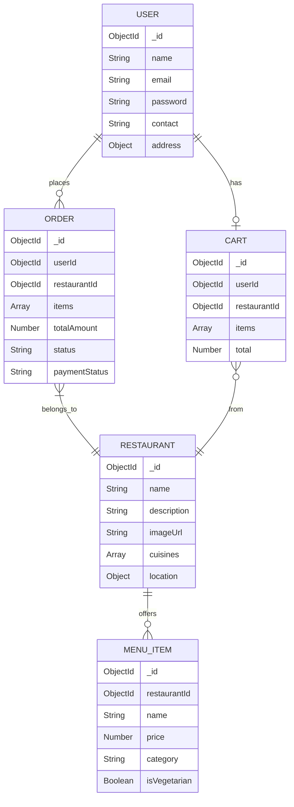

## Entity-Relationship Diagram (ERD)

A simplified view of how the primary **MongoDB** collections relate to each other .

```mermaid
erDiagram
    USER ||--o{ ORDER : places
    USER ||--o| CART : has
    RESTAURANT ||--o{ MENU_ITEM : offers
    ORDER }|--|| RESTAURANT : belongs_to
    CART }o--|| RESTAURANT : from
  
    USER {
        ObjectId _id
        String name
        String email
        String password
        String contact
        Object address
    }
  
    RESTAURANT {
        ObjectId _id
        String name
        String description
        String imageUrl
        Array cuisines
        Object location
    }
  
    MENU_ITEM {
        ObjectId _id
        ObjectId restaurantId
        String name
        Number price
        String category
        Boolean isVegetarian
    }
  
    ORDER {
        ObjectId _id
        ObjectId userId
        ObjectId restaurantId
        Array items
        Number totalAmount
        String status
        String paymentStatus
    }
  
    CART {
        ObjectId _id
        ObjectId userId
        ObjectId restaurantId
        Array  items
        Number total
    }
```
