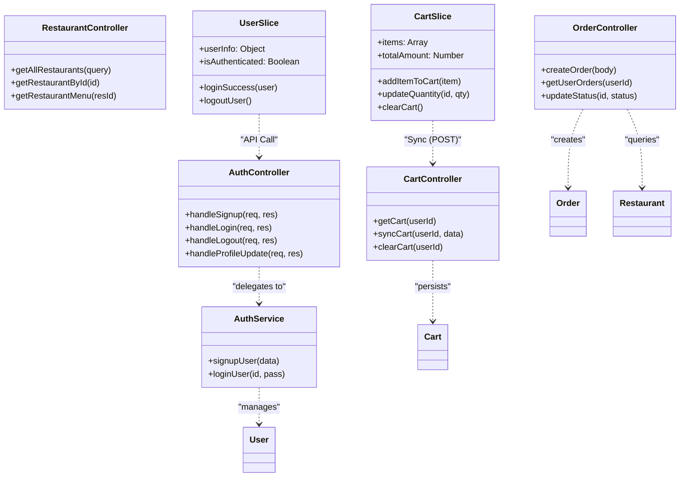

# Class Diagram - Eats Architecture

This diagram illustrates the logical structure of the system, separating the Backend (Controller/Service/Model) and Frontend (State/API).

## Architecture Overview (Mermaid)

## Structural Details

### Backend Layering (Industry Standard)
1. **Model Layer**: Defines Mongoose Schemas and Hooks (e.g., `userSchema.pre('save')` for hashing).
2. **Controller Layer**: Handles HTTP parsing and response formatting.
3. **Service Layer**: (Used in Auth) Encapsulates business logic that isn't tied to HTTP.
4. **Middleware Layer**: 
    - `userAuth`: Verifies JWT from cookies and attaches `user` object to `req`.

### Frontend State Flow
- **Hydration**: The `App.jsx` component performs "State Hydration". It pulls data from the Backend `Cart` model and updates the Redux `CartSlice` on application load.
- **Encapsulation**: API logic is separated into `authApi.js` and `axiosInstance.js` to provide a clean interface for UI components.
