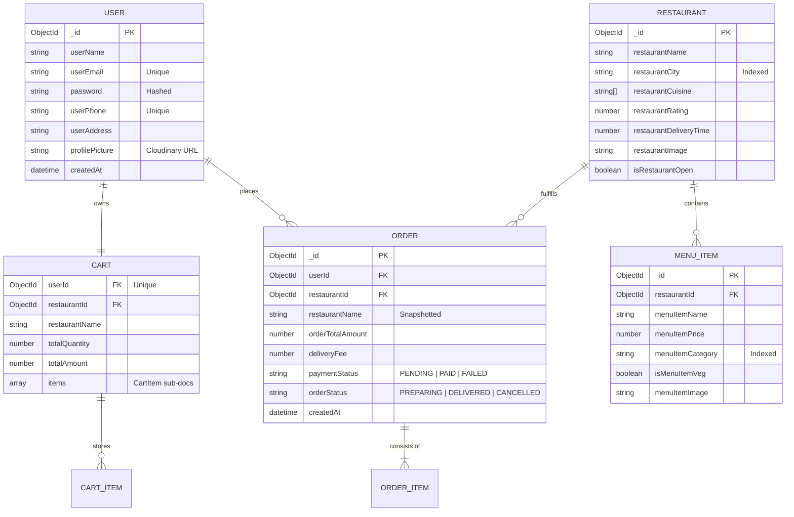

# Entity-Relationship (ER) Diagram - Eats System

The ER Diagram defines the data structure and relationships between core entities in the MongoDB database.

## Database Schema (Mermaid)

## Field Level Analysis (Industry Standard)

### 1. Snapshotting Pattern (Order Entity)
To ensure historical accuracy, the `Order` entity does **not** simply reference `MENU_ITEM`. It contains an `orderItems` array with:
- `itemName`: String (copied from MenuItem)
- `itemPrice`: Number (copied from MenuItem)
- `itemQuantity`: Number

### 2. Indexing Strategy
- **User**: Unique index on `userEmail` and `userPhone` for O(1) login lookups.
- **Restaurant**: Compound index on `restaurantCity + restaurantCuisine` to optimize discovery queries.
- **Order**: Descending index on `userId + createdAt` for fast order history rendering.

### 3. Cart Persistence
Unlike standard e-commerce, the `Cart` is a first-class entity in the DB, linked to the `User` via `userId`. This enables **Cross-Device Persistence**.
