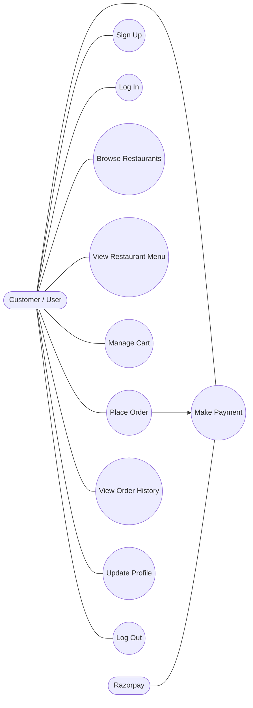
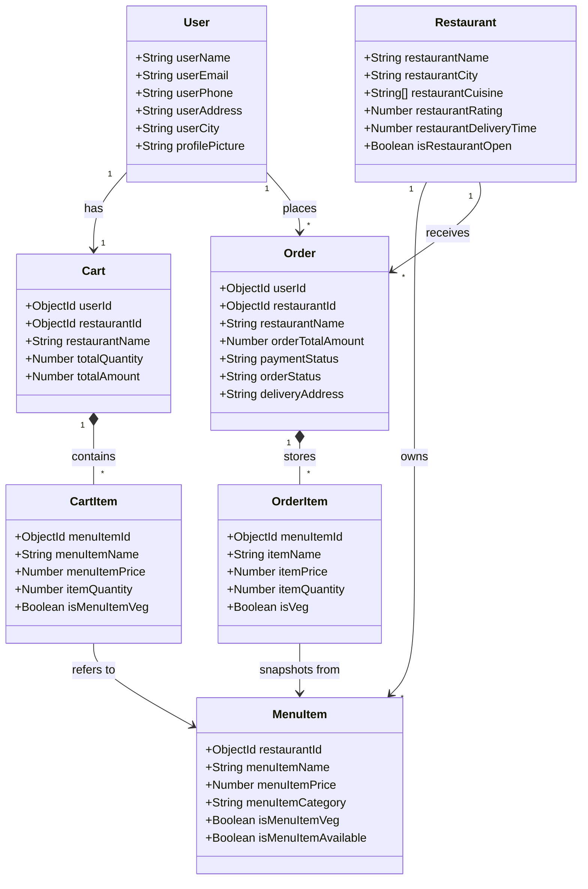
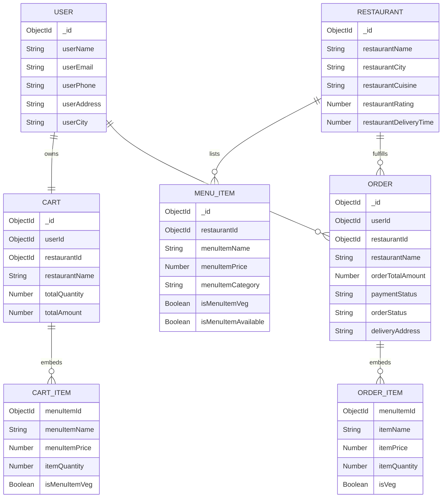

# System Diagrams Implementation Plan

> **For agentic workers:** REQUIRED SUB-SKILL: Use superpowers:subagent-driven-development (recommended) or superpowers:executing-plans to implement this plan task-by-task. Steps use checkbox (`- [ ]`) syntax for tracking.

**Goal:** Create a root-level `SYSTEM_DIAGRAMS.md` file that documents the Eats project with accurate Mermaid use case, class, and ER diagrams plus short explanatory notes.

**Architecture:** The work is a documentation-only change centered on one Markdown file. The content should be derived from the backend models in `server/src/models/` and the API summary in `PROJECT_OVERVIEW.md`, with each diagram scoped to a different abstraction level: actor behavior, logical domain structure, and persisted data relationships.

**Tech Stack:** Markdown, Mermaid, Git, existing Mongoose model files, project docs

---

### Task 1: Create The Document Skeleton And Use Case Diagram

**Files:**
- Create: `SYSTEM_DIAGRAMS.md`
- Reference: `PROJECT_OVERVIEW.md`
- Reference: `README.md`

- [ ] **Step 1: Create the Markdown file with title, intro, and use case section**

```md
# Eats System Diagrams

This document summarizes the Eats platform with three views of the system:

- Use case diagram for user-facing behavior
- Class diagram for the core backend/domain structure
- ER diagram for the persisted data model

## 1. Use Case Diagram

This diagram shows the major interactions between the customer and the Eats platform, with Razorpay included only for payment processing.
```

- [ ] **Step 2: Add the Mermaid use case diagram block**

```md

```

- [ ] **Step 3: Add a short mapping note under the use case diagram**

```md
How this maps to the codebase:
- Authentication flows are implemented under `server/src/routes/authRouter.js`.
- Restaurant browsing and menu access are implemented under `server/src/routes/restaurantRouter.js`.
- Cart, order, and payment flows are implemented under `server/src/routes/cartRouter.js`, `server/src/routes/orderRouter.js`, and `server/src/routes/paymentRouter.js`.
```

- [ ] **Step 4: Verify the section content is present**

Run: `sed -n '1,120p' SYSTEM_DIAGRAMS.md`
Expected: The output shows the title, intro, use case section heading, Mermaid block, and mapping note.

- [ ] **Step 5: Commit the first slice**

```bash
git add SYSTEM_DIAGRAMS.md
git commit -m "docs: add system diagram use case section"
```

### Task 2: Add The Class Diagram

**Files:**
- Modify: `SYSTEM_DIAGRAMS.md`
- Reference: `server/src/models/User.js`
- Reference: `server/src/models/Restaurant.js`
- Reference: `server/src/models/MenuItem.js`
- Reference: `server/src/models/Cart.js`
- Reference: `server/src/models/Order.js`

- [ ] **Step 1: Add the class diagram section heading and explanation**

```md
## 2. Class Diagram

This diagram shows the logical structure of the main backend/domain entities without including frontend framework details or low-level helper internals.
```

- [ ] **Step 2: Add the Mermaid class diagram block**

```md

```

- [ ] **Step 3: Add the mapping note for the class diagram**

```md
How this maps to the codebase:
- The classes are derived from the Mongoose models in `server/src/models/`.
- `CartItem` and `OrderItem` are embedded subdocuments in `Cart.js` and `Order.js`.
- The class diagram is intentionally logical rather than framework-specific, so Redux slices and controller internals are omitted.
```

- [ ] **Step 4: Verify the class diagram section**

Run: `sed -n '1,220p' SYSTEM_DIAGRAMS.md`
Expected: The output includes a second section with a Mermaid `classDiagram` block and the mapping note.

- [ ] **Step 5: Commit the second slice**

```bash
git add SYSTEM_DIAGRAMS.md
git commit -m "docs: add system class diagram"
```

### Task 3: Add The ER Diagram And Final Mapping Notes

**Files:**
- Modify: `SYSTEM_DIAGRAMS.md`
- Reference: `server/src/models/User.js`
- Reference: `server/src/models/Restaurant.js`
- Reference: `server/src/models/MenuItem.js`
- Reference: `server/src/models/Cart.js`
- Reference: `server/src/models/Order.js`
- Reference: `PROJECT_OVERVIEW.md`

- [ ] **Step 1: Add the ER diagram section heading and explanation**

```md
## 3. ER Diagram

This diagram reflects the persisted MongoDB data model more closely, including referenced collections and embedded item arrays used for carts and order snapshots.
```

- [ ] **Step 2: Add the Mermaid ER diagram block**

```md

```

- [ ] **Step 3: Add the final mapping section**

```md
## Codebase Mapping Notes

- `User`, `Restaurant`, and `MenuItem` are top-level collections defined in `server/src/models/`.
- `Cart` is a one-cart-per-user collection with embedded `items`.
- `Order` stores historical snapshots of ordered items so menu changes do not rewrite past orders.
- The diagrams align with the API groupings documented in `PROJECT_OVERVIEW.md`.
```

- [ ] **Step 4: Verify the full document**

Run: `sed -n '1,320p' SYSTEM_DIAGRAMS.md`
Expected: The output shows all three sections, all three Mermaid blocks, and the final mapping notes in one cohesive document.

- [ ] **Step 5: Commit the final document**

```bash
git add SYSTEM_DIAGRAMS.md
git commit -m "docs: add system diagrams documentation"
```

### Task 4: Final Review And Consistency Check

**Files:**
- Modify: `SYSTEM_DIAGRAMS.md` (only if fixes are needed)
- Reference: `README.md`
- Reference: `PROJECT_OVERVIEW.md`
- Reference: `server/src/models/User.js`
- Reference: `server/src/models/Restaurant.js`
- Reference: `server/src/models/MenuItem.js`
- Reference: `server/src/models/Cart.js`
- Reference: `server/src/models/Order.js`

- [ ] **Step 1: Compare diagram terminology with the model files**

Run: `rg -n "userName|restaurantName|menuItemName|orderStatus|paymentStatus" server/src/models SYSTEM_DIAGRAMS.md`
Expected: The names used in the document match the actual schema field names where the diagrams intend to mirror persistence.

- [ ] **Step 2: Review the final Markdown for readability**

Run: `sed -n '1,320p' SYSTEM_DIAGRAMS.md`
Expected: Headings are ordered correctly, explanatory notes are short, and the document reads cleanly top to bottom.

- [ ] **Step 3: Apply any required wording or field-name fixes**

```md
Replace any mismatched field labels or confusing relationship names directly in `SYSTEM_DIAGRAMS.md` so the diagrams stay aligned with the current codebase.
```

- [ ] **Step 4: Check git diff for the final artifact**

Run: `git diff -- SYSTEM_DIAGRAMS.md`
Expected: The diff contains only the intended documentation content for the diagrams file.

- [ ] **Step 5: Commit any final polish if Step 3 changed the file**

```bash
git add SYSTEM_DIAGRAMS.md
git commit -m "docs: polish system diagrams wording"
```
